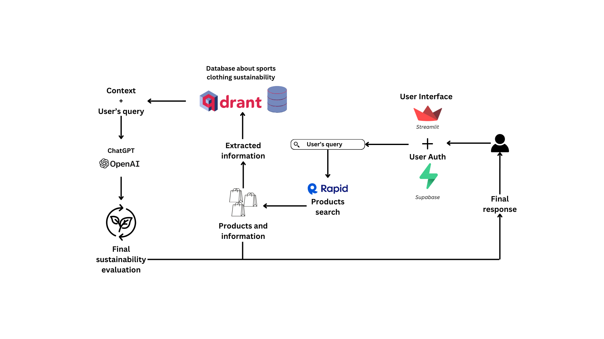

# GreenFit AI technical details

## Table of contents
{: .no_toc .text-delta }

1. TOC
{:toc}

---

## Workflow

    

 

## Authentication and user management

> _Code reference [here](https://github.com/AstraBert/streamlit_supabase_auth_ui)_

Authentication and user management are achieved through the [`streamlit_supabase_auth_ui`](https://github.com/AstraBert/streamlit_supabase_auth_ui). The authentication UI, based on [Gauri Prabhakar](https://github.com/GauriSP10)'s login interface, combines the power of [**Supabase**](https://supabase.co/) PostgreSQL databases with the seamless frontend components from **Streamlit**, connecting it also to the e-mail notifications service offered by [**Courier**](https://www.courier.com/).

Upon registration, the user name, email and (hashed) password will be stored in a Supabase database: they will also receive a confirmation e-mail by Courier. When the user logs in, we send a request to the database, seeing if their password and username match with the stored ones. Users can also change their password if they lost it. 

## Product search functionalities

> _Code reference [here](https://github.com/greenfit-ai/greenfit-ai/blob/main/scripts/utils.py)_

Product search functionalities are a two-step process:

- **The natural language query from the user gets transformed into a browser-optimized query**: `gtp-4o-mini` transform the query into a list of keywords, which is retrieved thanks to [Langchain](https://langchain.com)+[Pydantic](https://pydantic.dev/) structured output schemas and parsers.
- **The keywords are used to search Google Products**: thanks to [Rapid](https://rapidapi.com/hub) Product Search API, we send a request to Google Products with the extracted key-words. This returns a list of a user-specified number of products, with each entry of the list being a JSON/dictionary object.

## Vector Database and Retrieval Augemented Generation

> _Code reference [here](https://github.com/greenfit-ai/greenfit-ai/blob/main/scripts/utils.py)_

We extract metadata from the products, such as price, title and description. We combine these metadata to search a curated database containing sustainability information on sport clothing brands. This information was vectorized and is stored inside an on-cloud instance of a [Qdrant](https://qdrant.tech) vector database. We perform semantic search on the database and we retrieve the context that will be given to ChatGPT for its sustainability scoring evaluation.

## Sustainability scoring

> _Code reference [here](https://github.com/greenfit-ai/greenfit-ai/blob/main/scripts/utils.py)_

Sustainability scoring is achieved thanks to `gtp-4o-mini`, which, based on the products information and on the context it is given, gives the products a score out of 10 for three sustainability fields:

- Renewable energy usage
- Low-carbon materials usage
- Overall sustainability

These scores also come with the reasons why `gtp-4o-mini` assigned them. 

Collecting ordered scores and the reasons for them is achieved through [Langchain](https://langchain.com)+[Pydantic](https://pydantic.dev/) structured output schemas and parsers.

## Frontend, secrets management and serving

> _Code reference [here](https://github.com/greenfit-ai/greenfit-ai/blob/main/app.py)_

The frontend is managed with Streamlit. It is a one-page application with:

- A text input area for the user query
- A number-based input bar to define the maximum number of results
- The [demo application on HuggingFace Spaces](https://huggingface.co/spaces/greenfit-ai/greenfit-ai) also has two other text input areas, for the Rapid Product Search API key and for the OpenAI API key.

It displays results in Markdown format.

The style of the application is defined in a `.streamlit/config.toml` file.

All the secrets are defined in a `.streamlit/secrets.toml` file and are also securely stored under HuggingFace Spaces secrets. 

The app can be directly deployed on [Streamlit](https://streamlit.io) (connecting it from GitHub), but we preferred keeping our demo on [HuggingFace Spaces](https://huggingface.co/spaces).